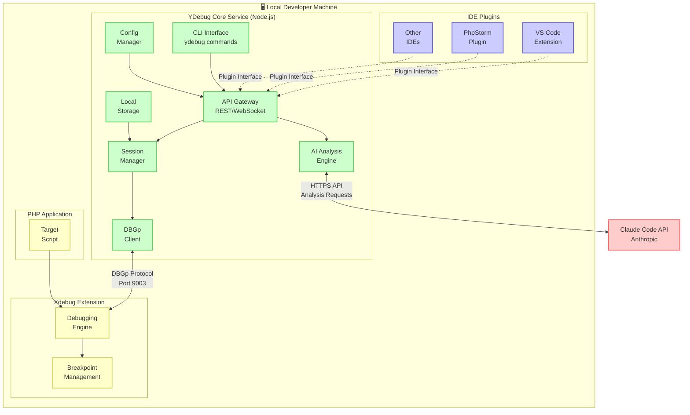

# YDebug: Architectural Overview
**AI Agent PHP Debugging Solution**

**Date:** 2025-11-08  
**Status:** Comprehensive Architectural Reference  
**Document Version:** 1.0

---

## Executive Summary

YDebug is an AI Agent PHP Debugging Solution that enables AI agents to participate in step-through debugging of PHP applications. The architecture is built on seven core architectural decisions that establish a CLI-first, locally-deployed tool using industry-standard debugging protocols with future extensibility for community contributions.

**Key Architectural Principles:**
- **CLI-first approach** with plugin architecture for future extensibility
- **Local deployment** ensuring maximum security and privacy
- **Provisional decisions** enabling learning and architectural evolution
- **Industry-standard protocols** (Xdebug/DBGp) for reliability and compatibility
- **Community extensibility** through plugin architecture and open interfaces

**Development Phases:**
- **Prototype Goal:** AI agent inspects variable values at one breakpoint in simple PHP script
- **MVP Goal:** Full debugging control with step-through execution, variable inspection, and breakpoint management
- **Future Vision:** Community-driven plugin ecosystem with multiple IDE integrations

## Complete Architecture Diagram



**Architecture Flow:**
1. **Developer** → CLI commands or IDE plugins
2. **YDebug Core** → Processes requests via API Gateway
3. **DBGp Client** → Communicates with Xdebug over TCP (port 9003)
4. **AI Engine** → Sends analysis requests to Claude Code API
5. **Local Storage** → All debugging data remains on developer machine

## Core Components

### 1. YDebug Core Service (Node.js)
**Primary Runtime:** Node.js application providing the foundation for all debugging operations.

**Responsibilities:**
- DBGp protocol client implementation for Xdebug communication
- Session management and state tracking
- Configuration management and storage
- API Gateway providing REST and WebSocket interfaces
- Local file system management for logs and configuration

**Key Features:**
- Direct TCP socket communication with Xdebug (port 9003)
- XML-based DBGp message parsing and generation
- Concurrent debugging session support
- Real-time event streaming via WebSocket
- Local configuration file management

### 2. CLI Interface
**Primary User Interface:** Command-line interface for debugging session control and monitoring.

**Core Commands:**
- `ydebug start` - Initialize debugging session
- `ydebug connect` - Connect AI agent to session
- `ydebug logs` - Stream real-time debugging events
- `ydebug inspect` - View current variable state
- `ydebug analyze` - Request AI analysis of debugging context

**Real-time Features:**
- Live debugging event streaming
- Interactive session monitoring
- AI analysis result display
- Configuration management

### 3. AI Analysis Engine (Claude Code Integration)
**AI Provider:** Anthropic Claude Code integration for intelligent debugging analysis.

**Capabilities:**
- Variable state analysis and reasoning
- Execution flow understanding
- Code context comprehension
- Debugging insight generation
- Natural language explanations

**Implementation:**
- Official Anthropic SDK integration
- Custom prompt engineering for debugging contexts
- Rate limiting and error handling
- Cost optimization and usage monitoring

### 4. Plugin Architecture System
**Future Extensibility:** Interface system enabling community-driven IDE integrations.

**Plugin Interface:**
- Standardized API for debugging operations
- Event subscription model for real-time updates
- Configuration management integration
- Security and privacy controls

**Communication Methods:**
- IPC for local IDE plugin communication
- HTTP API for web-based integrations
- Socket communication for real-time events
- File system events for configuration sharing

## Technology Stack

### Core Technologies
| Component | Technology | Rationale |
|-----------|------------|-----------|
| **Runtime** | Node.js 18+ | Team expertise, rapid prototyping, DBGp library availability |
| **Debugging Protocol** | Xdebug with DBGp | Industry standard, mature ecosystem, comprehensive features |
| **AI Platform** | Anthropic Claude Code | Team expertise, proven code analysis capabilities |
| **Interface** | CLI (Command Line) | Rapid development, scriptable, IDE-agnostic |
| **Deployment** | Local Installation | Security, privacy, performance, developer trust |

### Supporting Technologies
| Purpose | Technology | Implementation Details |
|---------|------------|----------------------|
| **Package Distribution** | npm | `npm install -g ydebug` |
| **Configuration** | JSON | Local configuration files |
| **Communication** | TCP Sockets | DBGp protocol (port 9003) |
| **API Integration** | HTTPS | Claude Code API calls |
| **Event Streaming** | WebSocket | Real-time debugging events |
| **Storage** | File System | Local logs, configuration, session data |

## Decision Summary

### Architecture Decision Records Status

| ADR | Decision | Status | Rationale |
|-----|----------|---------|-----------|
| **ADR-001** | Xdebug with DBGp Protocol | **Accepted** | Industry standard, proven reliability, extensive features |
| **ADR-002** | Node.js for Prototype | **Provisional** | Team expertise, rapid development, reconsider after prototype |
| **ADR-003** | API Gateway Architecture | **Accepted** | Clean separation, scalable, platform-agnostic AI integration |
| **ADR-004** | CLI Interface for Prototype | **Provisional** | Rapid development, plugin architecture foundation |
| **ADR-005** | Claude Code Integration | **Accepted** | Team expertise, proven code analysis capabilities |
| **ADR-006** | Local Development Tool | **Accepted** | Security, privacy, performance, developer trust |
| **ADR-007** | IDE-Agnostic Plugin Architecture | **Accepted** | Flexibility, extensibility, community contributions |

### Key Decision Themes

#### Provisional vs. Accepted Decisions
**Provisional Decisions** (subject to reconsideration after prototype):
- **Node.js Runtime:** May migrate to Python if DBGp library limitations emerge
- **CLI Interface:** Will expand to plugin-based IDE integrations post-prototype

**Accepted Decisions** (foundational architectural commitments):
- **Xdebug/DBGp Protocol:** Industry standard approach
- **Local Deployment:** Security and privacy priority
- **Claude Code Integration:** Team expertise leverage
- **Plugin Architecture:** Community extensibility strategy

#### Risk Mitigation Strategies
- **Modular architecture** enables technology migration without complete rewrites
- **Clean interfaces** separate concerns and enable component evolution
- **Plugin architecture** provides extensibility without core complexity
- **Local deployment** eliminates external dependencies and security risks

## Implementation Phases

Implementation details and development timeline are documented in [Implementation Plan](../plan/Implementation.md).

## Security & Privacy

### Local-First Security Model
**Core Principle:** All source code and debugging data remains local to developer machine.

**Security Implementation:**
- **Zero External Code Transmission:** Source code never leaves local environment
- **Local Session Management:** All debugging sessions handled locally
- **Controlled AI Interaction:** Only explicit analysis requests sent to Claude Code API
- **No Authentication Complexity:** No user accounts or external access management

### Privacy Protection
**Data Handling:**
- **GDPR Compliance:** No personal data transmission to external services
- **Corporate Policy Alignment:** Meets strict code confidentiality requirements
- **Audit Trail:** Local logging for security audit requirements
- **Data Sovereignty:** Complete data control within local environment

### Network Security
**Communication Patterns:**
- **Minimal Attack Surface:** Only local network ports for Xdebug communication
- **HTTPS API Calls:** Secure communication for AI features only
- **No Persistent Connections:** No long-lived external connections
- **Local Configuration:** All sensitive settings stored locally

### Risk Mitigation
- **Security Reviews:** Regular security assessment of local tool
- **Update Mechanism:** Secure auto-update with user consent
- **Configuration Security:** Local file permissions and access control
- **Error Handling:** Secure error reporting without data exposure

## Extensibility Strategy

### Plugin Architecture Vision
**Community-Driven Extensibility:** Enable third-party developers to create IDE-specific integrations and custom features.

#### Plugin Interface Design
```javascript
// Standardized Plugin Interface
interface YDebugPlugin {
  // Core debugging operations
  startSession(config: DebugConfig): Promise<SessionResult>
  stopSession(sessionId: string): Promise<void>
  
  // Event handling
  onBreakpoint(callback: BreakpointHandler): void
  onVariableChange(callback: VariableHandler): void
  
  // AI integration
  requestAnalysis(context: DebugContext): Promise<AIAnalysis>
  displayAnalysis(analysis: AIAnalysis): Promise<void>
  
  // Configuration management
  getConfiguration(): PluginConfig
  updateConfiguration(config: PluginConfig): Promise<void>
}
```

#### Plugin Development Support
**Developer Resources:**
- Complete plugin interface documentation
- Reference implementation and development templates
- Plugin development workshops and tutorials
- Community contribution guidelines and support
- Plugin quality review and certification process

### IDE Integration Roadmap

#### High Priority: VS Code Extension
**Target Timeline:** 2-3 months post-MVP  
**Key Features:**
- Debugging session integration with VS Code debugging UI
- AI analysis display within debugging views
- Configuration management through VS Code settings
- Breakpoint enhancement with AI insights

#### Medium Priority: PhpStorm Plugin
**Target Timeline:** 4-6 months post-MVP  
**Key Features:**
- Integration with existing Xdebug debugging functionality
- AI analysis overlay in debugging interface
- Enhanced variable inspection with AI insights
- Code quality suggestions during debugging sessions

#### Community-Driven: Other Editors
**Vim/Neovim, Emacs, Sublime Text:** Based on community demand and contributions

### Future Architecture Evolution

#### Multi-Platform AI Support
**Post-Prototype Expansion:**
```javascript
// Future multi-platform AI architecture
class AIManager {
  constructor() {
    this.providers = {
      claude: new ClaudeProvider(),
      openai: new OpenAIProvider(),
      custom: new CustomProvider()
    };
  }
  
  async analyzeWithBest(context) {
    // Platform selection based on context type
  }
}
```

#### Enterprise Features
**Long-term Considerations:**
- Team debugging session sharing
- Enterprise authentication and access control
- Advanced monitoring and analytics
- On-premises AI model hosting

## Development Guidelines

### Architectural Principles

#### 1. CLI-First Development
- Prioritize command-line interface functionality
- Design plugin interfaces as CLI enhancements
- Maintain CLI as primary user experience
- Ensure all features accessible via CLI

#### 2. Local Security Priority
- No external data transmission without explicit user consent
- Local storage for all debugging and configuration data
- Secure communication patterns for AI API integration
- Regular security reviews and vulnerability assessments

#### 3. Modular Architecture
- Clean separation between components
- Well-defined interfaces for component interaction
- Enable component evolution without system rewrites
- Support technology migration through abstraction layers

#### 4. Community Extensibility
- Design plugin interfaces for third-party contributions
- Provide comprehensive documentation for plugin development
- Establish quality standards for community contributions
- Enable ecosystem growth around YDebug core

### Development Standards

#### Code Quality
- Comprehensive unit testing for all core components
- Integration testing for DBGp protocol communication
- End-to-end testing for complete debugging scenarios
- Regular code reviews and quality assessments

#### Documentation Requirements
- Complete API documentation for all interfaces
- Plugin development guides and tutorials
- User documentation for CLI and configuration
- Architecture documentation for contributors

#### Performance Standards
- Debugging operations under 100ms latency locally
- AI analysis responses under 5 seconds average
- Memory usage optimization for long debugging sessions
- Efficient handling of large debugging datasets

## References

### Architecture Decision Records
- [ADR-001: Choose Xdebug with DBGp Protocol](/Users/d.wenzel/projekt/ydebug/documentation/architecture/001-choose-xdebug-dbgp-protocol.md) - Foundational debugging technology
- [ADR-002: Choose Node.js for Prototype](/Users/d.wenzel/projekt/ydebug/documentation/architecture/002-choose-nodejs-for-prototype.md) - Provisional runtime selection
- [ADR-003: Choose API Gateway Architecture](/Users/d.wenzel/projekt/ydebug/documentation/architecture/003-choose-api-gateway-architecture.md) - AI integration pattern
- [ADR-004: Choose CLI Interface for Prototype](/Users/d.wenzel/projekt/ydebug/documentation/architecture/004-choose-cli-interface-for-prototype.md) - Provisional interface selection
- [ADR-005: Choose Claude Code Integration](/Users/d.wenzel/projekt/ydebug/documentation/architecture/005-choose-claude-code-integration.md) - AI platform selection
- [ADR-006: Choose Local Development Tool Deployment](/Users/d.wenzel/projekt/ydebug/documentation/architecture/006-choose-local-deployment-model.md) - Security and deployment model
- [ADR-007: Choose IDE-Agnostic Plugin Architecture](/Users/d.wenzel/projekt/ydebug/documentation/architecture/007-choose-ide-agnostic-plugin-architecture.md) - Extensibility strategy

### Project Planning Documents
- [Project Goal](/Users/d.wenzel/projekt/ydebug/documentation/plan/goal.md) - Vision and core concept
- [Prototype Scope](/Users/d.wenzel/projekt/ydebug/documentation/plan/prototype.md) - Proof of concept definition
- [MVP Scope](/Users/d.wenzel/projekt/ydebug/documentation/plan/mvp.md) - Full feature vision

### External References
- [Xdebug Documentation](https://xdebug.org/docs/) - Debugging protocol specification
- [DBGp Protocol Specification](https://xdebug.org/docs/dbgp) - Communication protocol details
- [Anthropic Claude Code API](https://claude.ai/code) - AI integration documentation
- [Node.js Documentation](https://nodejs.org/docs/) - Runtime platform documentation

---

**Document Maintainers:** YDebug Development Team  
**Review Schedule:** Monthly architecture review, quarterly comprehensive review  
**Next Review Date:** 2025-12-08 (Post-prototype evaluation)  
**Version History:** v1.0 (2025-11-08) - Initial comprehensive overview